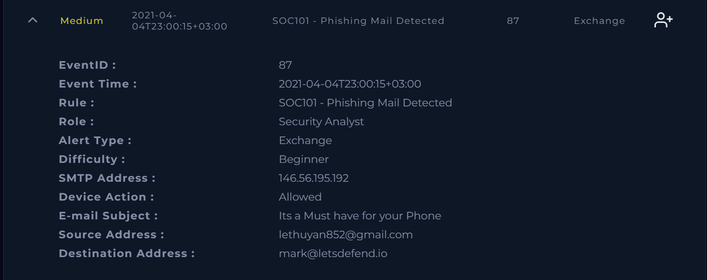
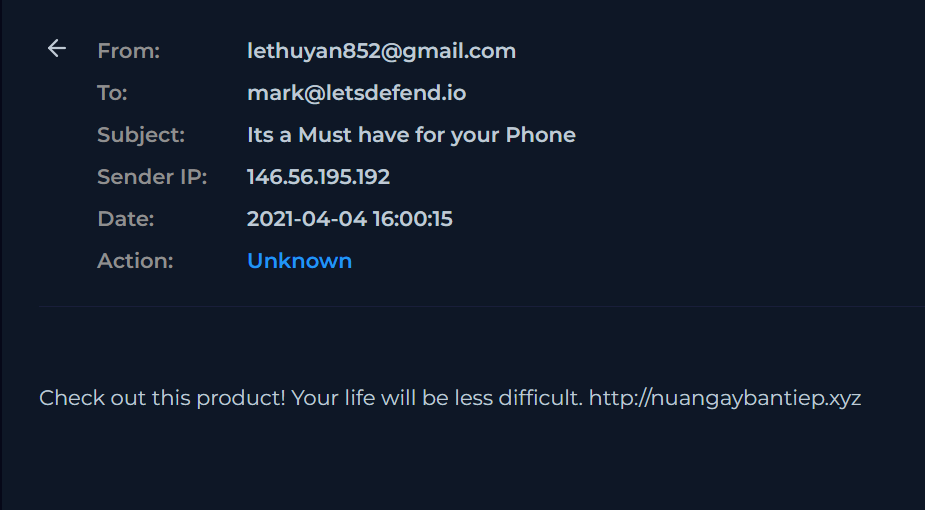
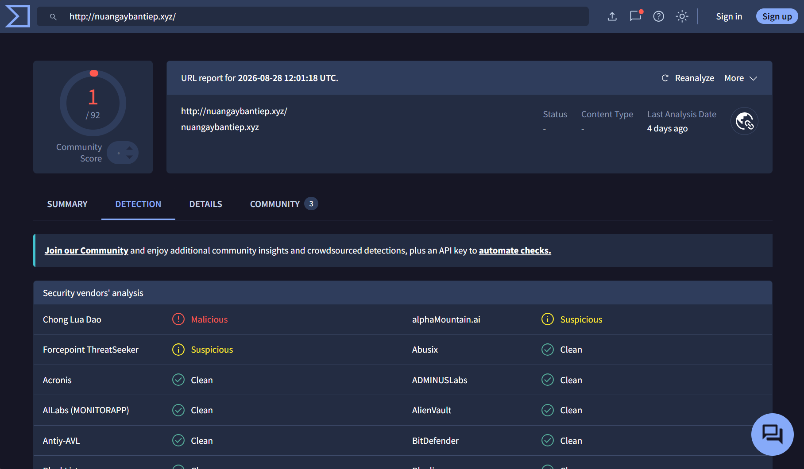
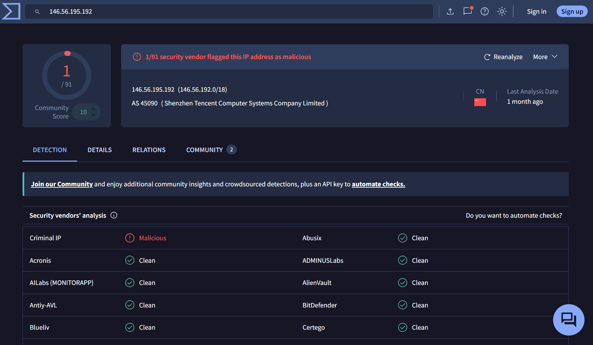
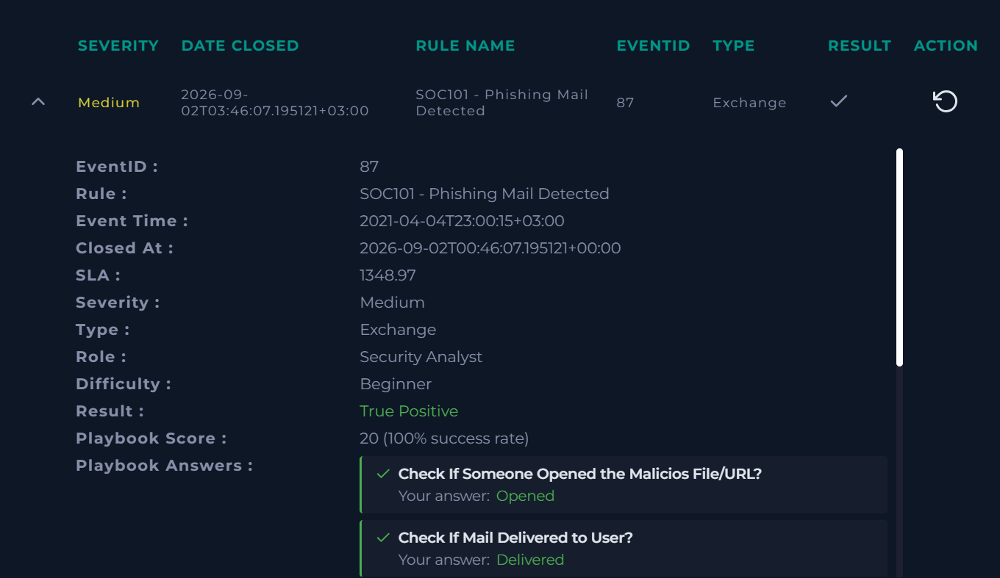
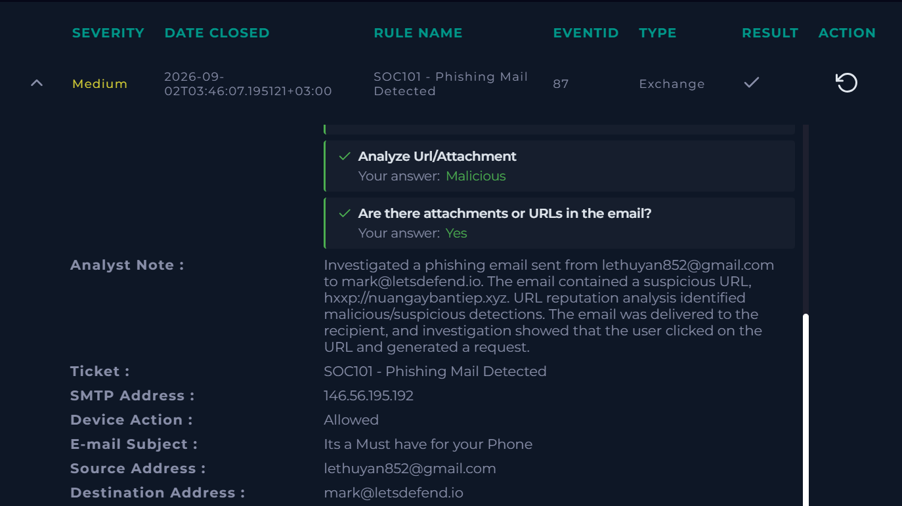

# Phishing Email Analysis

## Project Overview

This project documents the investigation of a phishing email alert in a simulated SOC environment using LetsDefend. The investigation involved analyzing the email, identifying suspicious indicators, investigating a URL using threat intelligence, documenting indicators of compromise (IOCs), and determining the final incident classification.

## Alert Details

- Alert: SOC101 - Phishing Mail Detected
- Severity: Medium
- Alert Type: Exchange
- Role: Security Analyst

## Investigation Objectives

The investigation focused on:

- Reviewing the sender and recipient information
- Examining the email content for phishing indicators
- Identifying suspicious URLs
- Performing URL reputation analysis
- Documenting indicators of compromise
- Determining whether the email was delivered
- Determining whether the recipient interacted with the malicious URL
- Classifying the alert based on the available evidence

## Tools Used

- LetsDefend
- VirusTotal
- AnyRun
- URLHouse
- URLScan

## Investigation

### 1. Initial Alert Review

The investigation began with a review of the SOC alert and associated email metadata.

### 2. Email Analysis

The email sender, recipient, subject, source IP address, message content, and embedded URL were examined for suspicious characteristics.

### 3. URL Analysis

The URL identified within the email was analyzed using VirusTotal to obtain additional threat intelligence and reputation information.

### 4. Indicators of Compromise

Relevant indicators discovered during the investigation were documented as artifacts for the incident.

The sender IP address was also analyzed using VirusTotal as part of the IOC investigation.

### 5. Incident Determination

The investigation determined that the phishing email was delivered to the recipient and that the recipient interacted with the malicious URL.

**Final Verdict: True Positive - Phishing**

## Skills Demonstrated

- Phishing email analysis
- SOC alert triage
- Threat intelligence research
- URL reputation analysis
- Indicator of Compromise (IOC) identification
- Incident investigation
- Security documentation
- Alert classification

## Disclaimer

This project was completed in a simulated cybersecurity training environment. All information and indicators shown are associated with the training scenario and are documented for educational and portfolio purposes.
